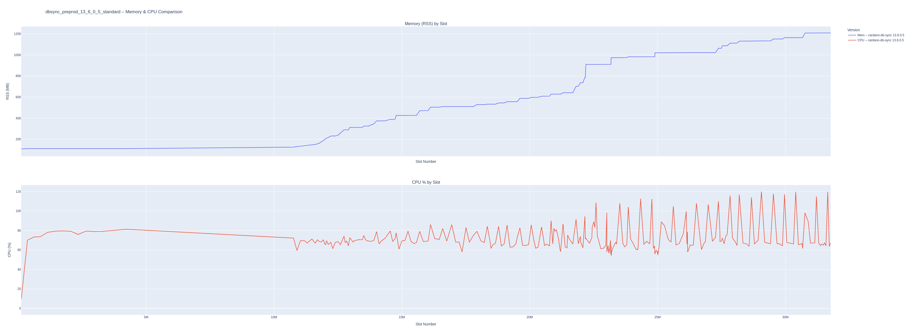
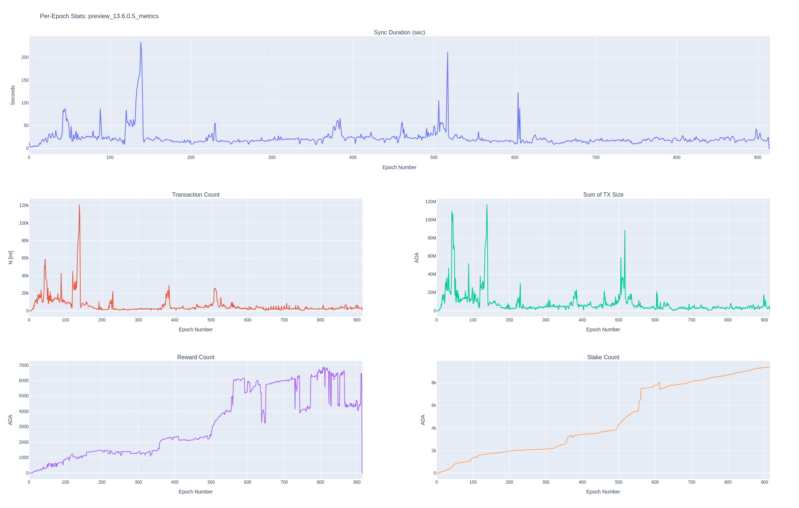

# cardano-db-sync-monitoring

A/B testing toolkit for `cardano-node` and `cardano-db-sync`: long-running
resource samplers, on-disk size collectors, a cardano-node RTS/runtime scraper,
plotters with gap-aware rendering, postgres-side comparison reports, and
supporting utilities (SQLite backup, version rename) — with a tested core and CI
across Python 3.10–3.12.

**Latest release:** [`v1.2.0`](https://github.com/ArturWieczorek/cardano-db-sync-monitoring/releases/tag/v1.2.0)
— 2026-06-04 — see [`CHANGELOG.md`](CHANGELOG.md) for the full release notes.

---

# Quickstart: from zero to A/B comparison

Full workflow for comparing two `cardano-db-sync` versions on preprod, end-to-end:

```bash
# 1. Install runtime deps (or `make install` + `make shell`).
uv venv .venv && source .venv/bin/activate && uv pip install -r requirements.txt

# 2. Start cardano-node + db-sync for version A (e.g. 13.6.0.5) writing to its own postgres DB.
#    Then in a separate terminal, attach the monitor:
nohup python3 scripts/db-sync-monitor.py \
  --env preprod --db-sync-ver 13.6.0.5 --pg-dbname preprod_13.6.0.5 \
  > logs/db-sync-monitor-13.6.0.5.log 2>&1 &

# 3. When db-sync reaches tip, stop it (Ctrl-C the monitor will keep going if you want
#    to capture post-tip behavior). Then repeat for version B with its own pg DB:
nohup python3 scripts/db-sync-monitor.py \
  --env preprod --db-sync-ver 13.7.1.0 --pg-dbname preprod_13.7.1.0 \
  > logs/db-sync-monitor-13.7.1.0.log 2>&1 &

# 4. Plot the resource curves side-by-side (one HTML per metric set):
python3 scripts/db-sync-plot.py --env preprod \
  --versions 13.6.0.5,13.7.1.0 --metrics all --x-axis time

# 5. Run the postgres-side comparison report (chain-state stats + headline deltas):
python3 scripts/db-sync-report.py --pg-dbname preprod_13.6.0.5,preprod_13.7.1.0
```

After that you'll have:

- `plots/cardano-db-sync/preprod/preprod_13.6.0.5_vs_13.7.1.0_*_by_*.html` — three HTML plots (cpu_ram, ingest, tables)
- `plots/cardano-db-sync/preprod_13.6.0.5_vs_preprod_13.7.1.0_epoch_stats_<ts>.html` — per-epoch comparison plot
- `stats/preprod_13.6.0.5_vs_preprod_13.7.1.0_summary_<ts>.txt` — headline deltas (Total sync time A vs B → −27%, etc.)
- `stats/preprod_13.6.0.5_vs_preprod_13.7.1.0_db_size_report_<ts>.txt` — full per-table and per-index size breakdown

Same flow works for cardano-node A/B comparisons via `node-monitor.py` / `node-plot.py` — node-side has no `db-sync-report.py` equivalent because it doesn't write to postgres.


# Per-script quickstart

Task-organized cheat sheet — most common ways to start each tool. Each script's deeper section further down has the full flag reference and examples.

### Monitor a cardano-node run

Prereq: `cardano-node` is already running and `cardano-cli` can reach its socket.

```bash
# Foreground (Ctrl-C to stop)
python3 scripts/node-monitor.py --env preprod --node-ver 11.0.1

# Background, survives SSH/tmux disconnects
nohup python3 scripts/node-monitor.py --env preprod --node-ver 11.0.1 \
  > logs/node-monitor-preprod.log 2>&1 &

# JSON-per-line output for log analyzers (jq / fluentd / etc.)
python3 scripts/node-monitor.py --env preprod --node-ver 11.0.1 --json
```

`--node-ver` is **your** label; it tags rows in `data/cardano-node/<env>.db` so multiple versions can coexist. Full reference: [`# node-monitor.py`](#node-monitorpy).

### Monitor a cardano-db-sync run

Prereq: `cardano-db-sync` is running and writing to a Postgres DB.

```bash
# Standard form — uses PGHOST/PGPORT/PGUSER env vars if set, else psycopg2 defaults
python3 scripts/db-sync-monitor.py \
  --env preprod --db-sync-ver 13.7.1.0 --pg-dbname preprod_13.7.1.0

# Explicit Postgres params
python3 scripts/db-sync-monitor.py \
  --env preprod --db-sync-ver 13.7.1.0 --pg-dbname preprod_13.7.1.0 \
  --pg-host localhost --pg-port 5432 --pg-user postgres

# Background
nohup python3 scripts/db-sync-monitor.py \
  --env preprod --db-sync-ver 13.7.1.0 --pg-dbname preprod_13.7.1.0 \
  > logs/db-sync-monitor-preprod.log 2>&1 &

# JSON-per-line output
python3 scripts/db-sync-monitor.py \
  --env preprod --db-sync-ver 13.7.1.0 --pg-dbname preprod_13.7.1.0 --json
```

Each version-under-test gets its own `--pg-dbname` AND a distinct `--db-sync-ver` label. Same env (e.g. `preprod`) means everything lands in the same SQLite stats DB (`data/cardano-db-sync/preprod.db`), where the version labels keep runs separated. Full reference: [`# db-sync-monitor.py`](#db-sync-monitorpy).

### Track on-disk size (optional, separate collector)

Standalone collectors that sample a directory's `du` size over time, into the same `<env>.db` under the same version label. Run alongside the resource monitor when you care about on-disk growth (e.g. comparing an LSM build's footprint against an in-memory one).

```bash
# cardano-node db directory (auto-discovers --database-path)
python3 scripts/node-db-size-monitor.py --env preprod --node-ver 11.0.1

# cardano-db-sync ledger-state directory (auto-discovers --state-dir)
python3 scripts/db-sync-ledger-size-monitor.py --env preprod --db-sync-ver 13.7.1.0
```

Coarse cadence by default (`--interval 60`) since `du` is heavy. Match the `--node-ver` / `--db-sync-ver` label to the resource monitor's so the series join. Plot with `--metrics disk`. Full reference: [`# On-disk size monitors`](#on-disk-size-monitors).

### Track cardano-node RTS / runtime metrics (optional, separate collector)

Standalone scraper that polls the node's Prometheus endpoint for GHC runtime gauges (GC, allocations, heap/live bytes, mempool) and appends them to the same `<env>.db` under the same `--node-ver` label. Run alongside `node-monitor.py` when you want the runtime signals psutil can't see (e.g. comparing GC pressure or allocation rates across node versions).

```bash
# Scrape the node's Prometheus endpoint (default http://127.0.0.1:12798/metrics)
python3 scripts/node-rts-monitor.py --env preprod --node-ver 11.0.1

# Discover the exact metric names your node exposes, then exit
python3 scripts/node-rts-monitor.py --env preprod --node-ver 11.0.1 --list-metrics
```

`node-monitor.py` is left untouched — the scrape is isolated behind a timeout so a slow/dead endpoint just skips the sample. Needs the node run with `+RTS -T` and `hasPrometheus`. Plot with `--metrics rts`. Full reference: [`# RTS / runtime metrics monitor`](#rts--runtime-metrics-monitor).

### Plot a cardano-node SQLite DB

```bash
# List versions available in the DB
python3 scripts/node-plot.py --env preprod --list

# Default — CPU/RSS for one version (or interactive picker if --versions omitted)
python3 scripts/node-plot.py --env preprod --versions 11.0.1

# A/B comparison — two versions overlaid
python3 scripts/node-plot.py --env preprod --versions 10.1.4,11.0.1

# Time-axis instead of slot-axis (catches stalls + steady-state behavior)
python3 scripts/node-plot.py --env preprod --versions 11.0.1 --x-axis time

# Sync time by era (bar) + sync duration per epoch (line)
python3 scripts/node-plot.py --env preprod --versions 10.1.4,11.0.1 --metrics ingest

# On-disk db-directory size over time (total + lsm subdir) — needs node-db-size-monitor.py data
python3 scripts/node-plot.py --env preprod --versions 10.1.4,11.0.1 --metrics disk

# RTS / runtime gauges (GC, allocations, heap/live, mempool) — needs node-rts-monitor.py data
python3 scripts/node-plot.py --env preprod --versions 10.1.4,11.0.1 --metrics rts

# Everything — one HTML per kind (disk / rts skipped if not collected)
python3 scripts/node-plot.py --env preprod --versions 10.1.4,11.0.1 --metrics all
```

Output lands in `plots/cardano-node/<env>/`. Full reference: [`# node-plot.py`](#node-plotpy).

### Plot a cardano-db-sync SQLite DB

```bash
# List versions
python3 scripts/db-sync-plot.py --env preprod --list

# Default — CPU/RSS for one version
python3 scripts/db-sync-plot.py --env preprod --versions 13.7.1.0

# A/B comparison, CPU/RSS only
python3 scripts/db-sync-plot.py --env preprod --versions 13.6.0.5,13.7.1.0

# Ingest metrics (tip lag, DB size, block/tx insert rate, UTXO count if tracked)
python3 scripts/db-sync-plot.py --env preprod --versions 13.6.0.5,13.7.1.0 \
  --metrics ingest --x-axis time

# Hot-table row counts over time (log y-axis, one line per table)
python3 scripts/db-sync-plot.py --env preprod --versions 13.6.0.5,13.7.1.0 \
  --metrics tables --x-axis time

# On-disk ledger-state size over time (total + lsm subdir) — needs db-sync-ledger-size-monitor.py data
python3 scripts/db-sync-plot.py --env preprod --versions 13.6.0.5,13.7.1.0 --metrics disk

# Everything at once — one HTML per kind (cpu_ram, ingest, tables, disk; disk skipped if not collected)
python3 scripts/db-sync-plot.py --env preprod --versions 13.6.0.5,13.7.1.0 \
  --metrics all --x-axis time
```

Output lands in `plots/cardano-db-sync/<env>/`. Full reference: [`# db-sync-plot.py`](#db-sync-plotpy).

### Run the Postgres report (db-sync only)

Queries Postgres directly for chain-state stats — sync time per epoch and per era, fees, MA mints, table/index sizes, UTXO count.

```bash
# Single version
python3 scripts/db-sync-report.py --pg-dbname preprod_13.7.1.0

# A/B comparison — produces a headline-deltas table
python3 scripts/db-sync-report.py --pg-dbname preprod_13.6.0.5,preprod_13.7.1.0

# Mainnet-safe: skip the expensive per-epoch fetchers (~5-10 min saved)
python3 scripts/db-sync-report.py --pg-dbname preprod_13.7.1.0 --skip-slow

# Heavy: also compute p95 tx size per epoch (adds 5-20 min on mainnet)
python3 scripts/db-sync-report.py --pg-dbname preprod_13.7.1.0 --with-p95
```

HTML lands in `plots/cardano-db-sync/`; text reports in `stats/`. Full reference: [`# db-sync-report.py`](#db-sync-reportpy).

### Run something not working as expected?

See [`# Troubleshooting`](#troubleshooting) at the bottom of this README — catalogues the messages you'll actually see (UTXO probe timeout, missing `ts` column, schema-migration wait, missing `ingest_metrics`/`table_rowcounts`, etc.) with what each means and what to do.

### Want to understand *why*?

This README is the *how to run* doc. For the theory — why time-series, what each graph actually tells you, statistics behind mean/p95, how the SQL is structured — see [`docs/`](docs/README.md). Six focused markdown files aimed at someone new to monitoring as a discipline:

- [01 — Time-series fundamentals](docs/01-time-series-fundamentals.md)
- [02 — Cardano domain primer](docs/02-cardano-domain-primer.md)
- [03 — Graph catalog](docs/03-graph-catalog.md) (one entry per chart we produce)
- [04 — Statistics primer](docs/04-statistics-primer.md)
- [05 — Database internals](docs/05-database-internals.md)
- [06 — Glossary](docs/06-glossary.md)


# Installation

## Requirements

- [`uv`](https://github.com/astral-sh/uv) (or plain `pip` — see "Manual" below)
- Python 3.10+

## Make (recommended)

```bash
make install   # creates .venv, installs runtime deps, drops you into a shell
make shell     # re-enter the venv shell anytime
make clean     # remove .venv
```

`make help` prints the same. `make install` spawns a subshell inside `.venv`, so even though the prompt may not show `(.venv)`, `which python3` confirms you're inside the venv. Type `exit` to leave the subshell.

## Manual (pip / uv)

```bash
uv venv .venv && source .venv/bin/activate
uv pip install -r requirements.txt          # runtime deps
uv pip install -r requirements-dev.txt      # adds pytest/ruff/mypy/pre-commit
```

Equivalent without uv:

```bash
python3 -m venv .venv && source .venv/bin/activate
pip install -r requirements.txt
```

Or install from `pyproject.toml` directly:

```bash
pip install .          # runtime only
pip install .[dev]     # runtime + dev tools
```

## Reproducible installs

`uv.lock` pins every transitive dep including dev tools. Regenerate after dependency changes:

```bash
uv pip compile pyproject.toml --extra dev -o uv.lock
```

## For contributors

After cloning + installing dev deps, install the pre-commit hooks once:

```bash
pre-commit install
```

This wires up `ruff check --fix`, `ruff format`, and `mypy` to run on every `git commit`. CI runs the same checks (see [`.github/workflows/ci.yml`](.github/workflows/ci.yml)), so passing pre-commit locally is the cheapest way to keep CI green.

Tests run via `pytest`; configuration (test discovery, FutureWarning-promotion) lives in `pyproject.toml`'s `[tool.pytest.ini_options]`.

# Project layout

```
db-sync-monitoring/
├── scripts/                # CLI scripts (run from project root)
├── data/                   # SQLite stats DBs (gitignored)
│   ├── cardano-db-sync/<env>.db
│   └── cardano-node/<env>.db
├── plots/                  # HTML graphs (gitignored)
│   ├── cardano-db-sync/<env>/
│   └── cardano-node/<env>/
├── stats/                  # DB size reports (gitignored)
└── archive/                # Old artifacts kept for reference
```

All scripts resolve these paths relative to the project root, so they write to the canonical locations regardless of where you launch them from.

# Explanation of what scripts do

Each pair of scripts has a clean split of concerns:

- **`*-monitor.py`** — long-running collector. Samples a running `cardano-db-sync` / `cardano-node` process and writes rows to SQLite. Headless: no prompts, no browser, safe under `nohup` / `systemd` / `tmux`. Stops cleanly on `SIGINT` or `SIGTERM`.
- **`*-plot.py`** — on-demand visualizer. Reads the SQLite DB and writes a comparison HTML. Run it any time, as many times as you want. Interactive picker by default; `--versions` / `--list` for scripting.
- **`db-sync-report.py`** — one-shot Postgres report (epoch stats + DB/table sizes), independent of the SQLite stats DB.

CPU and RAM metrics are sampled via [`psutil`](https://psutil.readthedocs.io/).

## 📊 RAM Metrics
| Metric | Description |
|:---|:---|
| `rss` | Resident Set Size: physical memory used (in RAM). |
| `vms` | Virtual Memory Size: total virtual memory used. |
| `uss` | Unique Set Size: memory unique to the process (not shared). |
| `pss` | Proportional Set Size: memory shared proportionally between processes. |
| `swap` | Amount of swap memory the process is using. |
| `shared` | Amount of memory shared with other processes. |

Memory values are computed in mebibytes (`bytes / 1024²`) and stored that way in SQLite. Because the values are binary (1024-based), the console and graph axes label them with the matching **binary units** — **MiB**, promoting to **GiB** once a value crosses 1024 MiB. (Earlier releases labelled these **MB**/**GB**; that overstated a binary value by ~7.4% at the GiB level, since 1 GiB = 1.074 GB. The `--json` output now uses `rss_mib` / `vms_mib` keys to match.)

## 🖥️ CPU Metrics
| Metric | Description |
|:---|:---|
| `cpu_percent` | CPU usage percentage of the process. |
| `user_time` | Time spent in user mode (running user code). |
| `system_time` | Time spent in system mode (running kernel code). |
| `children_user` | Total user time of all child processes. |
| `children_system` | Total system time of all child processes. |
| `iowait` | Time spent waiting for I/O operations (disk/network). |
| `ctx_switches` | Number of context switches (voluntary + involuntary). |
| `interrupts` | Number of hardware interrupts the process received. |

---

The collector scripts attach to *already running* `cardano-node` / `cardano-db-sync` processes — start the node/db-sync first, then start the collector. Results are reported as a function of `slot_no`, with a wall-clock `ts` column also recorded for cases where the slot doesn't advance.


# `db-sync-monitor.py`

Long-running collector for a `cardano-db-sync` process. Writes samples to `data/cardano-db-sync/<env>.db`. Graphs are produced separately by `db-sync-plot.py` — the monitor never opens a browser or prompts for input.


## TL;DR

```sh
python3 scripts/db-sync-monitor.py --env preprod --db-sync-ver 13.6.0.5 --pg-dbname preprod_13.6.0.5_metrics
=== db-sync monitor | env=preprod | label=13.6.0.5 | pg_db=preprod_13.6.0.5_metrics | interval=10.0s ===
UTXO tracking: DISABLED — set tx-out.use_address_table or consumed_by_tx_id in your db-sync config to enable. utxo_count will not be sampled.
Slot 171760 | Epoch 3 | Sync 1.98% | TipLag 12d | DB 142.30 MiB | CPU 3.9% | RSS 110.3 MiB
Slot 420580 | Epoch 9 | Sync 2.25% | TipLag 11d | DB 198.70 MiB | CPU 69.9% | RSS 111.8 MiB
Slot 673880 | Epoch 15 | Sync 2.53% | TipLag 10d | DB 244.10 MiB | CPU 72.8% | RSS 111.8 MiB
Slot 911700 | Epoch 21 | Sync 2.79% | TipLag 9.4d | DB 285.00 MiB | CPU 71.0% | RSS 112.2 MiB
^C
Shutting down. Wrote 1248 samples to /…/data/cardano-db-sync/preprod.db.
```

Send `SIGINT` (Ctrl+C) or `SIGTERM` to stop cleanly. To survive SSH disconnects, run under `nohup`/`systemd`/`tmux`:

```sh
nohup .venv/bin/python scripts/db-sync-monitor.py --env preprod --db-sync-ver 13.6.0.5 \
  --pg-dbname preprod_13.6.0.5_metrics > logs/db-sync-monitor-preprod.log 2>&1 &
```

Required:
- `--env` — one of `mainnet`, `preprod`, `preview`
- `--db-sync-ver` — the label written to the stats DB (e.g. `13.6.0.5`, `13.6.0.5-hasql`, `lsm-13.7.1.0`). This is *your* label, not the upstream version — pick whatever distinguishes this run from others you'll compare it against. The full row label stored in SQLite is `cardano-db-sync <db-sync-ver> <env>`.
- `--pg-dbname` — Postgres database that `cardano-db-sync` is writing to. There's no convention; whatever you configured `cardano-db-sync` to use.

Optional:
- `--pg-host`, `--pg-port`, `--pg-user` — Postgres connection overrides. If unset, the script honors the standard `PGHOST` / `PGPORT` / `PGUSER` / `PGPASSWORD` env vars (the same convention `psql` uses), falling back to psycopg2's defaults (`localhost` / `5432` / current user).
- `--interval` (default `10`) — sampling interval in seconds.
- `--json` — emit one JSON object per sample on stdout (instead of the human-readable pipe-separated form). Each line includes `env`, `label`, `version`, `slot_no`, `epoch_no`, `sync_percent`, `tip_lag_sec`, `db_size_bytes`, `max_tx_id`, `utxo_count`, `cpu_percent`, `rss_mib`. Drop into `jq` / fluentd / any log analyzer without re-parsing.
- `--match-arg <substring>` — extra disambiguator when multiple `cardano-db-sync` processes share a host (e.g. LSM vs in-memory builds). The substring must appear somewhere in the matched process's command line (argv[0] including its full path + any argument); a short unique token like `lsm` or `inmem` works. Without this flag, the first `cardano-db-sync` process found wins, which can be the wrong one if more than one is running. See [Disambiguating multiple processes per env](#disambiguating-multiple-processes-per-env) below.

```bash
$ python3 scripts/db-sync-monitor.py
usage: db-sync-monitor.py [-h] --env {mainnet,preprod,preview} --db-sync-ver DB_SYNC_VER
                          [--pg-host PG_HOST] [--pg-port PG_PORT] [--pg-user PG_USER]
                          --pg-dbname PG_DBNAME [--interval INTERVAL] [--json]
db-sync-monitor.py: error: the following arguments are required: --env, --db-sync-ver, --pg-dbname
```

A new SQLite DB is created the first time you run for a given env:

```
data/cardano-db-sync/preprod.db
```

This file holds stats for every version tagged against the `preprod` env. Subsequent runs append to it, so you can compare versions later with `db-sync-plot.py`. The intended workflow is multi-version A/B: run the monitor once per version-under-test (each with a distinct `--db-sync-ver` label and its own `--pg-dbname`), then plot/report can compare them. **Don't delete the SQLite DB between runs** — that's how comparison is possible. Back it up if it's important.

The collector adds a `ts` (timestamp) column on first run if the DB pre-dates that column. It also enables SQLite WAL mode (`PRAGMA journal_mode=WAL`) so the plot/report scripts can read concurrently while the monitor writes — without it, long reads can block writes on a busy DB.

### Startup history notice

At startup the monitor reports whether the chosen version label already has samples in the SQLite DB, so you can tell at a glance if you're starting fresh or extending an earlier session:

```
This version label has no existing samples in data/cardano-db-sync/preprod.db.
```
or, on a re-run:
```
Note: this version label already has 3,606 samples in data/cardano-db-sync/preprod.db (first 2026-05-26T09:14:23, last 2026-05-26T11:31:38). New samples will be appended.
```

The model is append-only (same as Prometheus/InfluxDB — series identity comes from labels, not process lifetime). The notice exists because silent appending used to make multi-session syncs produce misleading "cliffs" in plots; see *gap-aware plotting* in [`db-sync-plot.py`](#db-sync-plotpy) for the visualization side of the fix.

### What gets stored

Each interval samples and writes rows to several SQLite tables:

| Table | What it holds |
|:---|:---|
| `memory_metrics` | `rss`, `vms`, `uss`, `pss`, `swap`, `shared` for the db-sync process |
| `cpu_metrics` | `cpu_percent`, user/system/iowait time, context switches |
| `ingest_metrics` | `tip_lag_sec` (distance from chain tip), `db_size_bytes`, `max_block_no`, `max_tx_id`, `utxo_count` (if enabled) |
| `table_rowcounts` | approximate row counts (`pg_class.reltuples`) for hot tables: `block`, `tx`, `tx_out`, `ma_tx_out`, `ma_tx_mint`, `multi_asset`, `datum`, `redeemer`, `script` |
| `db_sync_version` | one row per sample tagged with the version label |

All tables have `ts` (wall-clock) and `slot_no` columns so the data can be plotted on either axis. Row counts use the cheap `pg_class.reltuples` estimate rather than `COUNT(*)`, so sampling adds negligible load.

### UTXO tracking

At startup the monitor probes `tx_out.consumed_by_tx_id`. db-sync only populates this column when the operator enables it in config; if it's all NULL the monitor prints a warning and skips `utxo_count`. To enable, set the `tx-out` section in your db-sync config and resync (or migrate). Without it, `utxo_count` would degenerate to "total outputs" and would be misleading rather than wrong.


# `node-monitor.py`

Same idea as `db-sync-monitor.py`, but tracks a running `cardano-node` process. Stats go to `data/cardano-node/<env>.db`. The script attaches by matching the process executable and discovers the node's socket path from its command line.

## Run

```sh
$ python3 scripts/node-monitor.py --env preprod --node-ver 10.1.4
=== cardano-node monitor | env=preprod | label=10.1.4 | interval=10.0s ===
Slot 1234567 | Epoch 543 | Era Conway | Sync 100.00% | CPU 65.2% | RSS 4.4 GiB
Slot 1234580 | Epoch 543 | Era Conway | Sync 100.00% | CPU 67.8% | RSS 4.4 GiB
...
^C
Shutting down. Wrote 1248 samples to /…/data/cardano-node/preprod.db.
```

Required:
- `--env` — one of `mainnet`, `preprod`, `preview`
- `--node-ver` — label used to tag this run in the DB (e.g. `10.1.4`, `test-refactor-11.0.1`). The full row label is `cardano-node <node-ver> <env>`.

Optional:
- `--cardano-cli-path` — path to `cardano-cli` (used to query the current slot).
- `--cardano-node-path` — match a non-default node executable name/path.
- `--socket-path` — override the node socket; usually auto-detected from the process command line.
- `--interval` — sampling interval in seconds (default `10`).
- `--json` — emit one JSON object per sample on stdout (instead of the pipe-separated form). Same shape as `db-sync-monitor.py --json`, with `slot_no`, `epoch_no`, `era`, `sync_percent`, `cpu_percent`, `rss_mib`, etc.
- `--match-arg <substring>` — extra disambiguator when multiple `cardano-node` processes share a host. The env name (`preprod`, `mainnet`, etc.) is already required to appear in argv as the first-level filter; `--match-arg` adds a second substring that must also appear (in any arg or in argv[0]'s path). See [Disambiguating multiple processes per env](#disambiguating-multiple-processes-per-env) below.

At startup the monitor reports whether the chosen version label already has samples in the SQLite DB (same notice as `db-sync-monitor.py`), so you can tell at a glance whether you're starting fresh or extending an earlier session.

### What gets stored

Each interval writes one row to each of these SQLite tables:

| Table | What it holds |
|:---|:---|
| `memory_metrics` | `rss`, `vms`, `uss`, `pss`, `swap`, `shared` for the cardano-node process |
| `cpu_metrics` | `cpu_percent`, user/system/iowait time, context switches |
| `node_ingest_metrics` | `slot_no`, `epoch_no`, `era` (from `cardano-cli query tip`), `sync_progress` — used by `node-plot.py --metrics ingest` for per-epoch / per-era sync duration plots |
| `node_version` | one row per sample tagged with the version label |

`node_ingest_metrics` was added after the original `memory_metrics`/`cpu_metrics` schema. Older runs in the DB don't have rows there; `--metrics ingest` will warn and skip those versions cleanly. New runs from this point on collect full data.


# On-disk size monitors

`node-db-size-monitor.py` and `db-sync-ledger-size-monitor.py` are standalone collectors that track how big a directory grows on disk over a run — the cardano-node database directory (`--database-path`) and the cardano-db-sync ledger-state directory (`--state-dir`), respectively — and append the series to the same `data/<role>/<env>.db` under the same version label the matching `*-monitor.py` uses, so the disk curve joins the rest of that run's metrics.

They're separate processes on purpose: a `du` of a multi-hundred-GB mainnet directory is a heavy, cache-polluting tree walk, so it runs on its own coarse cadence (default 60s) rather than biasing the 10-second CPU/RAM samples — and can be started and stopped independently. Each sample records the total directory size **and**, separately, the size of the optional `lsm/` subdir, so an LSM-backed build's on-disk footprint can be compared against a stock/in-memory one. On a build with no `lsm/` subdir the LSM figure is simply 0 and the subdir is never even walked.

## Run

```bash
# cardano-node db directory — auto-discovers --database-path from the running node
python3 scripts/node-db-size-monitor.py --env preprod --node-ver 11.0.1

# cardano-db-sync ledger-state directory — auto-discovers --state-dir from db-sync
python3 scripts/db-sync-ledger-size-monitor.py --env preprod --db-sync-ver 13.7.1.0

# Background, like the other monitors
nohup python3 scripts/db-sync-ledger-size-monitor.py \
  --env preprod --db-sync-ver 13.7.1.0 \
  > logs/db-sync-ledger-size-preprod.log 2>&1 &
```

Match the `--node-ver` / `--db-sync-ver` label to the one you gave the matching `*-monitor.py` so the disk series joins the rest of that run's metrics under the same version.

Optional flags (shared by both):
- `--path` — measure this directory directly instead of auto-discovering it from the running process's command line.
- `--interval` (default `60`) — sampling interval in seconds. `du` is heavy; keep it coarse.
- `--du-timeout` (default `120`) — per-`du` timeout in seconds; on timeout the sample is skipped rather than recording a bogus 0.
- `--lsm-subdir` (default `lsm`) — name of the subdir measured separately.
- `--json` — emit one JSON object per sample (`ts`, `env`, `label`, `version`, `path`, `total_bytes`, `lsm_bytes`).
- `--match-arg <substring>` — disambiguate when multiple node/db-sync processes are running, same as the resource monitors. db-sync takes no env flag, so it's matched on the `cardano-db-sync` binary prefix plus this substring.
- `--sqlite-db` — override the target SQLite DB path.

Both write a `disk_metrics` table (`ts`, `slot_no`, `path`, `total_bytes`, `lsm_bytes`, `version`) in WAL mode, so a size collector can run concurrently with the resource monitor on the same `<env>.db`. `slot_no` is left NULL — the collector deliberately doesn't query the node/db-sync for a slot — so the series is always plotted against wall-clock time. Visualize it with `db-sync-plot.py --metrics disk` / `node-plot.py --metrics disk` (below).


# RTS / runtime metrics monitor

`node-rts-monitor.py` is a standalone collector that scrapes the cardano-node Prometheus endpoint for GHC runtime gauges — GC counts, allocations, heap/live bytes, and mempool — and appends them to the same `data/cardano-node/<env>.db` under the same version label `node-monitor.py` uses, so the RTS curves join the rest of that run's metrics by `version`. These are the resource signals a GHC-version or allocator change shows up in, and that psutil's process-level RSS/CPU can't see.

It's a separate process on purpose: it adds an HTTP scrape per interval, isolated here behind a `--timeout` and a `try/except`, so a slow or unreachable endpoint just skips the sample and never stalls or crashes the psutil/tip sampling `node-monitor.py` does. `node-monitor.py` is left untouched — zero risk to a running mainnet collector.

The node exposes these metrics when run with `+RTS -T` and configured with `hasPrometheus: [host, port]` (default port `12798`). Metric *names* vary by node version and tracing backend, so the collector scrapes the whole endpoint and keeps the names matching a curated substring allowlist (`rts`, `gc`, `alloc`, `heap`, `live`, `mempool`) rather than exact names.

## Run

```bash
# Auto-uses the default endpoint http://127.0.0.1:12798/metrics
python3 scripts/node-rts-monitor.py --env preprod --node-ver 11.0.1

# Discovery: print every metric the endpoint exposes (and how many match the
# allowlist), then exit — use this to find your node's exact metric names
python3 scripts/node-rts-monitor.py --env preprod --node-ver 11.0.1 --list-metrics

# Background, like the other monitors
nohup python3 scripts/node-rts-monitor.py \
  --env preprod --node-ver 11.0.1 \
  > logs/node-rts-preprod.log 2>&1 &
```

Match the `--node-ver` label to the one you gave `node-monitor.py` so the RTS series joins the rest of that run's metrics under the same version.

Optional flags:
- `--prometheus-url` (default `http://127.0.0.1:12798/metrics`) — the node's Prometheus endpoint. For multiple nodes on one host, pass each instance's distinct port.
- `--include` (default `rts,gc,alloc,heap,live,mempool`) — comma-separated case-insensitive substrings; a metric is kept if its name contains any of them.
- `--interval` (default `10`) — sampling interval in seconds; the scrape is light.
- `--timeout` (default `5`) — per-scrape HTTP timeout in seconds; on timeout the sample is skipped.
- `--list-metrics` — scrape once, print everything the endpoint exposes, then exit.
- `--json` — emit one JSON object per sample (`ts`, `env`, `label`, `version`, `slot_no`, `metrics`).
- `--sqlite-db` — override the target SQLite DB path.

It writes an `rts_metrics` table (`ts`, `slot_no`, `metric`, `value`, `version`) in WAL mode, so it can run concurrently with the resource monitor on the same `<env>.db`. The table is intentionally long/narrow — one row per (sample, metric) — so any metric name works without schema churn. `slot_no` is stamped from the node's `slotNum` gauge, so the series can share the slot x-axis with the other node metrics. Visualize it with `node-plot.py --metrics rts` (below).


# `db-sync-plot.py`

Reads the SQLite stats DB and writes a comparison HTML into `plots/cardano-db-sync/<env>/`.

Interactive picker (default):

```bash
$ python3 scripts/db-sync-plot.py --env preprod
Available versions:
1. cardano-db-sync 13.6.0.5 preprod
Select versions to compare (comma-sep indices, e.g. 1,2): 1
Saved plot to plots/cardano-db-sync/preprod/preprod_13.6.0.5_cpu_ram_by_slot.html
```

Non-interactive (for scripting / CI):

```bash
# list versions only
python3 scripts/db-sync-plot.py --env preprod --list

# plot specific versions by label or short token
python3 scripts/db-sync-plot.py --env preprod --versions 13.6.0.5,13.6.0.5-hasql
```

`--versions` accepts the full label (`cardano-db-sync 13.6.0.5 preprod`) or the short token (`13.6.0.5`). Ambiguous or missing entries error out instead of silently dropping.

## Metric sets

Default behavior plots memory + CPU. Pick a different metric set with `--metrics`:

| Value | What it plots |
|:---|:---|
| `cpu_ram` (default) | RSS and CPU% — same as before |
| `ingest` | Tip lag, DB size, block insert rate, tx insert rate, UTXO set size (if enabled) |
| `tables` | Approximate row counts per hot table on a log y-axis (one line per table per version) |
| `disk` | On-disk ledger-state size over time (total + `lsm/` subdir), from the `disk_metrics` table written by `db-sync-ledger-size-monitor.py` |
| `all` | Produces one HTML for each of the above (`disk` is skipped with a notice if its table wasn't collected) |

```bash
# ingest metrics over time (what's the new version doing?)
python3 scripts/db-sync-plot.py --env preprod --versions 13.6.0.5 --metrics ingest --x-axis time

# hot-table row counts side-by-side
python3 scripts/db-sync-plot.py --env preprod --versions 13.6.0.5,13.6.0.5-hasql --metrics tables

# everything at once
python3 scripts/db-sync-plot.py --env preprod --versions 13.6.0.5 --metrics all --x-axis time
```

Output filenames follow the scheme `<env>_<versions>_<metrics>_by_<x-axis>.html` — every plot self-describes which env, which run(s), which metric set, and which x-axis it was rendered with, so a file viewed in isolation (downloaded, screenshotted, picked out of a directory listing) still tells you what it is even when the parent dir context is gone. Examples for a single version on preprod: `preprod_13.7.1.0_cpu_ram_by_time.html`, `preprod_13.7.1.0_ingest_by_time.html`, `preprod_13.7.1.0_tables_by_slot.html`, `preprod_13.7.1.0_disk_by_time.html` (the disk plot is always `_by_time` — `disk_metrics` has no slot). A two-version comparison adds `_vs_` (env stays at the front, once): `preprod_13.6.0.5_vs_13.7.1.0_cpu_ram_by_time.html`. If you select `ingest` or `tables` against a DB that was collected before these tables existed, the script bails with an explicit error pointing at the monitor; `disk` instead skips gracefully (it's an optional, separately-collected metric — see below).

### Missing-data warning when comparing versions

`ingest_metrics` and `table_rowcounts` were added later than `memory_metrics`/`cpu_metrics`. If you ask for a multi-version comparison and only some of the chosen versions have data in those newer tables, the script:

- prints a per-missing-version warning naming the version and the table,
- drops the missing versions from the trace list (so the legend isn't polluted with empty entries),
- adjusts the output filename to reflect what actually got plotted (no spurious `_vs_` if only one version remains).

This stops single-version plots from masquerading as comparisons when the older run simply doesn't have the newer time-series. `cpu_ram` comparisons are unaffected — those columns have existed since the original schema.

## Gap-aware plotting

The plot scripts break their lines across sampling gaps. After loading samples from SQLite, the loaders detect consecutive samples whose wall-clock `ts` gap exceeds 5× the sample interval (50 seconds by default) and insert a NaN marker at the gap midpoint. Plotly's `Scatter` doesn't connect across NaN, so the line breaks visibly.

Without this, a multi-session sync (or any monitor restart) produced a misleading near-vertical "cliff" connecting the last sample of one session to the first of the next, even when there was no data between them. The gap break now reads correctly as "no data here" instead of "memory dropped 2 GB instantly".

This applies to `cpu_ram`, `ingest`, `tables`, and `disk` modes, and to both `--x-axis slot` and `--x-axis time`. Gap detection always uses wall-clock `ts`, regardless of which axis you plot against.

## Time-axis mode

By default the x-axis is `slot_no`. Pass `--x-axis time` to plot against the wall-clock timestamp instead — useful for spotting periods where the node sits on the same slot. On a slot-axis plot, every sample taken during such a stall collapses onto a single x-coordinate; on a time-axis plot the same stall shows up as a horizontal segment of flat slot, often with rising RAM or CPU.

```bash
python3 scripts/db-sync-plot.py --env preprod --versions 13.6.0.5 --x-axis time
```

Notes:
- Time mode skips rows whose `ts` is NULL. Those came from collector runs that pre-date the `ts` column. If every selected row pre-dates `ts`, the script exits with a hint pointing back to `--x-axis slot`.
- The output filename encodes the x-axis as `_by_slot` / `_by_time` so the two modes don't overwrite each other (`preprod_13.7.1.0_cpu_ram_by_slot.html` vs `preprod_13.7.1.0_cpu_ram_by_time.html`).

Only `--env` is required. `--sqlite-db` defaults to `data/cardano-db-sync/<env>.db` and `--outdir` defaults to `plots/cardano-db-sync/` — both overridable.




# `node-plot.py`

Same as `db-sync-plot.py`, but reads the node stats DB and writes into `plots/cardano-node/<env>/`. Gap-aware plotting (lines break across sampling outages instead of drawing cliffs) applies here too — see the [Gap-aware plotting](#gap-aware-plotting) section above for the rationale.

```bash
$ python3 scripts/node-plot.py --env preprod
Available versions:
1. cardano-node 10.1.4 preprod
2. cardano-node 11.0.1 preprod
Select versions to compare (comma-sep indices, e.g. 1,2): 1,2
Saved plot to plots/cardano-node/preprod/preprod_10.1.4_vs_11.0.1_cpu_ram_by_slot.html
```

Non-interactive equivalents:

```bash
python3 scripts/node-plot.py --env preprod --list
python3 scripts/node-plot.py --env preprod --versions 10.1.4,11.0.1
```

`--x-axis time` also works here — same semantics as in `db-sync-plot.py` (see [Time-axis mode](#time-axis-mode) above):

```bash
python3 scripts/node-plot.py --env preprod --versions 10.1.4,11.0.1 --x-axis time
```

## Metric sets

| Value | What it plots |
|:---|:---|
| `cpu_ram` (default) | RSS and CPU% over slot_no (or wall-clock with `--x-axis time`) |
| `ingest` | Sync time by era (top bar chart) + sync duration per epoch (line). Reads from `node_ingest_metrics` written by the updated `node-monitor.py`. |
| `disk` | On-disk db-directory size over time (total + `lsm/` subdir), from the `disk_metrics` table written by `node-db-size-monitor.py` |
| `rts` | GHC RTS / runtime gauges (GC, allocations, heap/live bytes, mempool) — one subplot per metric, one line per version — from the `rts_metrics` table written by `node-rts-monitor.py` |
| `all` | Produces one HTML per kind (`disk` and `rts` are each skipped with a notice if their table wasn't collected) |

```bash
# Sync time by era + per-epoch duration, two versions overlaid
python3 scripts/node-plot.py --env preprod --versions 10.1.4,11.0.1 --metrics ingest

# Both kinds at once — produces <env>_<vers>_cpu_ram_by_slot.html and <env>_<vers>_ingest_by_slot.html
python3 scripts/node-plot.py --env preprod --versions 10.1.4,11.0.1 --metrics all
```

### What sync-duration-per-epoch actually means

For each (version, epoch_no) in `node_ingest_metrics`, the helper computes `max(ts) − min(ts)` — i.e. the wall-clock time the monitor observed samples for that epoch. During catch-up sync this is much shorter than the chain-time length of an epoch (e.g. 432,000 seconds on preprod), because the node ingests faster than real-time. At tip it tracks real time. So the chart answers "how long did the node take to chew through that epoch's blocks?"

The era bar above it sums these durations per era, sorted chronologically (Byron → Conway). Multi-version mode produces grouped bars and an overlaid per-epoch line per version.

**Caveat**: the first and last epochs of a sync session can be partially-observed (the monitor started mid-epoch or stopped mid-epoch), so their duration underestimates. For A/B comparison this noise cancels between runs.

`--metrics ingest` requires the `node_ingest_metrics` table which the current `node-monitor.py` writes. Older monitor runs that pre-date this table get a warning and are dropped from the plot; their `--metrics cpu_ram` plots continue to work normally.

Only `--env` is required. `--sqlite-db` defaults to `data/cardano-node/<env>.db` and `--outdir` defaults to `plots/cardano-node/` — both overridable.


# `db-sync-report.py`

Reads the `cardano-db-sync` postgres database directly and produces three artifacts:

1. **Per-epoch HTML plot** — a subplot grid of chain-activity stats over epochs.
2. **Size report** (text) — total DB size, per-table table/index breakdown, top 30 indexes by size.
3. **Summary report** (text) — high-level numbers: total sync time, slot/epoch range, **sync time per era** (Byron / Shelley / Allegra / Mary / Alonzo / Babbage / Conway with total, avg/epoch, and % of total), cumulative chain activity, top tables & indexes, UTXO count (if tracking enabled).

The per-epoch plot covers:
- **Sync time by era** (top bar chart): total seconds spent in Byron / Shelley / Allegra / Mary / Alonzo / Babbage / Conway. The era is derived from `epoch_param.protocol_major` (the *active* protocol version per epoch — i.e. the ledger state) rather than `block.proto_major` (which is a *per-block signal* from block producers and can advertise the next-upgrade version many epochs before the hard fork actually activates). A regression in Conway that's 3% of epochs but 20% of total sync time pops out here even if it's invisible in the per-epoch view.
- **Sync time** per epoch (`epoch_sync_time.seconds`).
- **Block count** and **transaction count** per epoch.
- **Total fees** (`SUM(tx.fee)`) and **total output** (`SUM(tx.out_sum)`) per epoch.
- **Avg tx size** per epoch (default). With `--with-p95`, an additional dashed line overlays the **p95 tx size** in the same panel. p95 is gated behind a flag because `PERCENTILE_CONT` is expensive on mainnet (5-20 minutes — PostgreSQL has to sort all ~100M `tx.size` values per epoch).
- **Sum of tx size** per epoch.
- **Plutus tx fraction** (tx with at least one redeemer / total tx) and **multi-asset mint events** per epoch.
- **Cumulative distinct multi-assets** — running total of unique assets ever minted. Monotonic curve; steepness shows when token issuance accelerated.
- **Reward count** and **stake count** per epoch.
- **Conway governance** (if those tables exist): voting procedures and drep registrations per epoch.

```bash
$ python3 scripts/db-sync-report.py
usage: db-sync-report.py [-h] [--pg-host PG_HOST] [--pg-port PG_PORT] [--pg-user PG_USER] --pg-dbname PG_DBNAME [--outdir OUTDIR]
db-sync-report.py: error: the following arguments are required: --pg-dbname


$ python3 scripts/db-sync-report.py --pg-dbname preprod_13.6.0.5_metrics

Saved plot to plots/cardano-db-sync/preprod_13.6.0.5_metrics_epoch_stats_20260525_223100.html
Wrote size report to stats/preprod_13.6.0.5_metrics_db_size_report_20260525_223100.txt
Wrote summary report to stats/preprod_13.6.0.5_metrics_summary_20260525_223100.txt
```

`--outdir` defaults to `plots/cardano-db-sync/`. Size and summary reports always go to `stats/` at the project root.

The Conway panels appear automatically when `voting_procedure` / `drep_registration` exist in the Postgres schema; otherwise they're silently omitted. The UTXO count in the summary is included only if `tx_out.consumed_by_tx_id` is populated (same condition as in `db-sync-monitor.py`).

## A/B comparison mode

Pass two postgres DB names to `--pg-dbname`, comma-separated, to produce a side-by-side comparison:

```bash
python3 scripts/db-sync-report.py \
  --pg-dbname preprod_13.6.0.5,preprod_13.7.1.0
```

What changes when two DBs are passed:

- **Per-epoch HTML**: every panel now contains two lines (one per DB), distinguished by colour and a legend entry showing the DB name. The era bar chart becomes a grouped bar (one cluster per era, two bars per cluster). The legend is enabled — you can toggle individual traces in the browser.
- **Size report**: one combined `dbA_vs_dbB_db_size_report_<ts>.txt` with both versions' table+index breakdowns under labelled `=== dbA ===` / `=== dbB ===` headers.
- **Summary report**: one combined `dbA_vs_dbB_summary_<ts>.txt` with three sections:
  - **`== Headline metrics ==`** — the A/B verdict at a glance. Total sync time, final DB size, blocks, transactions, fees, MA mints, distinct assets, Plutus tx fraction, UTXO size — each with a `Δ (b vs a)` column showing percent change (or percentage-point change for ratios).
  - **`== Sync time by era ==`** — era totals side by side with Δ. A regression confined to Conway pops out here even when the overall total looks even.
  - **`== Per-version details ==`** — the full single-version summary body for each DB, for when you need the absolute numbers and not just the delta.

The comparison is capped at two DBs. Three or more lines per panel becomes unreadable fast, and the headline-deltas table only makes sense pairwise.

### Output detail

Both single-version and comparison modes now print **all** tables and **all** indexes (largest first) in the size and summary reports — no top-N truncation. On mainnet that's hundreds of indexes; the reports are long but everything is tracked.

## Mainnet-safe flags

The report has two cost-control flags. They affect which panels appear; nothing in the output is silently wrong.

| Flag | What it changes | Cost on mainnet |
|:---|:---|:---|
| (default) | Default panels; **no p95**; full Plutus + cumulative-assets panels. | ~1-3 min |
| `--with-p95` | Adds a dashed p95 line over the avg-tx-size panel. | Adds 5-20 min (`PERCENTILE_CONT` sorts every `tx.size` per epoch). |
| `--skip-slow` | Drops Plutus adoption + cumulative distinct assets (their panels are also omitted; the summary's Plutus line reads "skipped"). | Saves several minutes by skipping `redeemer` and `ma_tx_mint` ident scans. |

The report also prints stage-by-stage progress (`[3/8] Rendering per-epoch HTML…`) and the total elapsed time on completion, so if any one query stalls you know which.

## Monitor: mainnet measurement bias

The monitor used to compute `sync_percent` and `tip_lag_sec` from `MIN(time)` / `MAX(time)` over `block` — that's a sequential scan of ~11M rows on mainnet, every 10 seconds, while db-sync is also writing to the same database. The seq scans contended with db-sync's writes for shared_buffers and disk I/O, which artificially slowed db-sync's measured throughput.

The current monitor caches the first block's timestamp once at startup (constant for the lifetime of a sync), then derives both `sync_percent` and `tip_lag_sec` from the tip row that `get_tip()` already returns — two indexed lookups per sample instead of two seq scans. Postgres load from monitoring is now negligible, and throughput numbers no longer carry monitor bias.

The UTXO-tracking probe also runs under a 5-second `statement_timeout`, so if the operator hasn't created an index on `tx_out.consumed_by_tx_id`, the monitor doesn't hang at startup — it logs a warning and proceeds with `utxo_count` disabled.





```sh
Database: preprod_13.6.0.5_metrics
Total size: 1.12 GiB

Table sizes:
  public.block                             → 252.00 MiB
  public.tx_out                            → 241.00 MiB
  public.tx_metadata                       → 170.00 MiB
  public.tx                                → 96.00 MiB
  public.datum                             → 89.00 MiB
  public.ma_tx_out                         → 83.00 MiB
  public.tx_in                             → 59.00 MiB
  public.script                            → 38.00 MiB
  public.multi_asset                       → 32.00 MiB
  public.ma_tx_mint                        → 20.00 MiB
  public.redeemer                          → 17.00 MiB
  public.redeemer_data                     → 8.38 MiB
  public.collateral_tx_in                  → 6.68 MiB
  ...
```


# SQLite

## WAL mode and the three DB files

After the monitor runs, the stats directory shows three files for one logical database:

```
data/cardano-node/preprod.db        # main database file
data/cardano-node/preprod.db-wal    # write-ahead log (pending writes)
data/cardano-node/preprod.db-shm    # shared-memory file (reader/writer coordination)
```

That's expected. The monitor opens each SQLite database in **WAL mode** (`PRAGMA journal_mode=WAL`) on first creation, and these are the artifacts SQLite produces for that mode.

### Why WAL mode at all

Two facts about how the project is used:

- **The monitor writes continuously** — one or more rows every 10 seconds for the lifetime of a sync (hours to days).
- **The plot and report scripts read the same DB** — often while the monitor is still writing, because you want to check progress mid-sync without stopping the collector.

Under SQLite's default journaling mode (rollback journal), readers and writers are **mutually exclusive** at the database level. A long-running read transaction blocks new writes, and an active write transaction blocks reads. With a busy monitor and a slow plot script, you'd see the monitor stall for seconds while the plot reads — silently corrupting your measurement, since the resource samples are supposed to be wall-clock-uniform.

WAL inverts this. Writers append their changes to a separate **write-ahead log** file (`.db-wal`) without touching the main `.db` file mid-transaction. Readers see a consistent snapshot of the main file and can ignore in-progress writes entirely. So:

- **Writers don't block readers.** Plot/report can run while the monitor writes.
- **Readers don't block writers.** A long-running plot doesn't pause the monitor.
- **One writer at a time** is still the rule (SQLite is single-writer regardless of mode), but our project only ever has one monitor process per env, so that's fine.

There's a small cost — writes accumulate in the WAL before being merged back into the main `.db`, so disk usage temporarily inflates. SQLite handles this automatically (see *checkpointing* below). For our workload — small inserts, infrequent reads — the trade-off is overwhelmingly in WAL's favor.

### What each file does

| File | Role | When it changes |
|:---|:---|:---|
| `<env>.db` | The main database. Holds all committed, checkpointed data. Lossless and complete if the WAL has been drained. | Updated when WAL contents are checkpointed back into it (every ~1000 pages by default, or on clean shutdown). |
| `<env>.db-wal` | Write-ahead log. Holds appended changes that haven't yet been merged into the main file. | Every monitor write appends here. Shrinks to ~0 bytes after a successful checkpoint. |
| `<env>.db-shm` | Shared-memory index used by readers and writers to coordinate. Tiny, fixed-size. | Created when any process opens the DB in WAL mode; deleted on full clean shutdown of all clients. |

A growing `.db-wal` file isn't a leak — it's pending data that hasn't been checkpointed yet. SQLite checkpoints automatically as the WAL grows (default threshold: 1000 pages, roughly 4 MB).

### Checkpoints

A **checkpoint** is the operation that takes pending writes from `.db-wal` and merges them into the main `.db` file. SQLite does this automatically:

- **PASSIVE checkpoint** on every commit (very cheap; merges what it can without blocking).
- **FULL or RESTART checkpoint** when the WAL exceeds the threshold (briefly waits for readers to finish, then merges everything).
- **TRUNCATE checkpoint** on the last connection close — drains the WAL completely and shrinks the file to 0 bytes.

You almost never need to think about checkpoints. If you want to force one manually (e.g. before a backup):

```bash
sqlite3 data/cardano-node/preprod.db "PRAGMA wal_checkpoint(TRUNCATE);"
```

### Things to know

**Don't delete `-wal` or `-shm` manually while the monitor is running.** All three files are one logical DB. Removing the WAL throws away any not-yet-checkpointed samples; removing the SHM can confuse the next process that opens the DB. SQLite cleans them up itself when appropriate.

**Don't copy just `.db` for a backup.** A naive `cp data/cardano-node/preprod.db /tmp/snapshot.db` while the monitor runs would snapshot only the main file, missing whatever's in `.db-wal`. Use SQLite's own backup API which is WAL-aware:

```bash
sqlite3 data/cardano-node/preprod.db ".backup '/tmp/snapshot.db'"
```

The result is a single consistent `.db` file (no `-wal`/`-shm` artifacts in the destination, because the backup is checkpointed before being written).

**The `.gitignore` already excludes them.** `*.db`, plus `/data/` and `/plots/` and `/stats/` as directory globs, mean none of these stats files end up in git. If you ever move a database outside `/data/`, the explicit `*.db-wal` and `*.db-shm` entries in `.gitignore` catch them.

**`PRAGMA journal_mode=WAL` is sticky.** Once set, the database remembers it across reopens until something explicitly switches it back. The monitor sets it on every `init_db()` call as a belt-and-braces, but you can also confirm with:

```bash
sqlite3 data/cardano-node/preprod.db "PRAGMA journal_mode;"
# Expected output: wal
```

### Backup script

Before any destructive operation (deleting rows for a version, manual schema tweaks, etc.), back up the SQLite DB. `scripts/backup-stats.py` wraps the WAL-aware backup so you don't have to remember the right `sqlite3 .backup` invocation:

```bash
# Back up both DBs for an env (whichever exist)
python3 scripts/backup-stats.py --env preprod

# Just one role
python3 scripts/backup-stats.py --env preprod --role node
python3 scripts/backup-stats.py --env preprod --role db-sync

# Arbitrary path (e.g. one you moved outside data/)
python3 scripts/backup-stats.py --path /tmp/my-archive.db

# Show existing backups for a DB
python3 scripts/backup-stats.py --env preprod --role node --list
```

Naming: `<original>.bak-YYYYMMDD_HHMMSS`, dropped next to the source file. Since the backups land under `data/`, they're already covered by `.gitignore`.

Important: this uses Python's `sqlite3.Connection.backup()` (the same API as `sqlite3 .backup` CLI), which is **WAL-aware** and safe to run while the monitor is writing. A naive `cp` of just the `.db` file would skip any pending writes in `.db-wal`. The output is a single consistent `.db` file with no `-wal`/`-shm` artifacts — restoring is just `cp` the backup back over the original (with the monitor stopped).

### Removing records

To remove every record associated with a specific version (e.g. `cardano-db-sync 13.6.0.5 preprod`) from every version-keyed table in your SQLite database, you can run the following `DELETE` statements—either via the `sqlite3` CLI or in your Python code. These will safely remove only rows matching that exact `version` string.

A db-sync DB has five tables that carry the `version` column (`memory_metrics`, `cpu_metrics`, `db_sync_version`, `ingest_metrics`, `table_rowcounts`); a node DB has four (`memory_metrics`, `cpu_metrics`, `node_version`, `node_ingest_metrics`). Every recipe below must touch each of them, otherwise stale rows under the old label will reappear in plots and reports.

```sql
-- Open your SQLite DB
$ sqlite3 data/cardano-db-sync/preprod.db

-- Delete from every version-keyed table
DELETE FROM memory_metrics   WHERE version = 'cardano-db-sync 13.6.0.5 preprod';
DELETE FROM cpu_metrics      WHERE version = 'cardano-db-sync 13.6.0.5 preprod';
DELETE FROM db_sync_version  WHERE version = 'cardano-db-sync 13.6.0.5 preprod';
DELETE FROM ingest_metrics   WHERE version = 'cardano-db-sync 13.6.0.5 preprod';
DELETE FROM table_rowcounts  WHERE version = 'cardano-db-sync 13.6.0.5 preprod';

-- (Optionally, verify no rows remain)
SELECT COUNT(*) FROM memory_metrics   WHERE version = 'cardano-db-sync 13.6.0.5 preprod';
SELECT COUNT(*) FROM cpu_metrics      WHERE version = 'cardano-db-sync 13.6.0.5 preprod';
SELECT COUNT(*) FROM db_sync_version  WHERE version = 'cardano-db-sync 13.6.0.5 preprod';
SELECT COUNT(*) FROM ingest_metrics   WHERE version = 'cardano-db-sync 13.6.0.5 preprod';
SELECT COUNT(*) FROM table_rowcounts  WHERE version = 'cardano-db-sync 13.6.0.5 preprod';

-- Exit
.quit
```

---

### In Python

If you prefer to do this within your monitoring script (using the `sqlite3` module), you could add a helper like:

```python
import sqlite3

# Pick the tuple that matches the DB you're cleaning. db-sync DBs have
# `ingest_metrics` and `table_rowcounts`; node DBs have `node_ingest_metrics`
# and use `node_version` instead of `db_sync_version`.
DB_SYNC_VERSION_TABLES = (
    'memory_metrics', 'cpu_metrics', 'db_sync_version',
    'ingest_metrics', 'table_rowcounts',
)
NODE_VERSION_TABLES = (
    'memory_metrics', 'cpu_metrics', 'node_version', 'node_ingest_metrics',
)

def purge_version(db_file: str, version: str, tables=DB_SYNC_VERSION_TABLES):
    with sqlite3.connect(db_file) as conn:
        c = conn.cursor()
        for tbl in tables:
            c.execute(f"DELETE FROM {tbl} WHERE version = ?", (version,))
        conn.commit()
```

Then call:

```python
# db-sync DB
purge_version('data/cardano-db-sync/preprod.db', 'cardano-db-sync 13.6.0.5 preprod')

# node DB — pass the node table tuple
purge_version('data/cardano-node/preprod.db',
              'cardano-node 10.1.4 preprod',
              tables=NODE_VERSION_TABLES)
```

This atomically deletes all rows for that version across every version-keyed table in the chosen DB.


### Updating stats for a wrong `db-sync` version

Easiest: use `scripts/rename-version.py`. It auto-detects role (db-sync vs node) from the DB schema, touches every version-keyed table in one transaction, takes a timestamped backup first, and refuses to merge two distinct series under one label:

```bash
python3 scripts/rename-version.py --env preprod --role db-sync \
    --from-version 'cardano-db-sync LSM-13.7.1.0-node 11.0.1 preprod' \
    --to-version   'cardano-db-sync LSM-13.7.1.0-node-11.0.1 preprod' \
    --dry-run    # drop --dry-run to apply
```

Flags: `--path` to point at any DB directly, `--no-backup` if you already took one, `--merge` to intentionally collapse two labels into one. If you skip `--role`, the script infers it from the `cardano-db-sync ` / `cardano-node ` prefix of `--from-version`.

If you'd rather do it by hand, here's the raw SQL the script runs. A db-sync DB has five tables that carry a `version` column — you must touch all of them, otherwise the plot script will join rows from some tables and silently drop the rest (e.g. `_ingest_by_*.html` and `_tables_by_*.html` will be empty for the renamed version):

```sql
UPDATE memory_metrics
   SET version = 'cardano-db-sync 13.6.0.5 preprod'
 WHERE version = 'cardano-db-sync 13.6.0.5';

UPDATE cpu_metrics
   SET version = 'cardano-db-sync 13.6.0.5 preprod'
 WHERE version = 'cardano-db-sync 13.6.0.5';

UPDATE db_sync_version
   SET version = 'cardano-db-sync 13.6.0.5 preprod'
 WHERE version = 'cardano-db-sync 13.6.0.5';

UPDATE ingest_metrics
   SET version = 'cardano-db-sync 13.6.0.5 preprod'
 WHERE version = 'cardano-db-sync 13.6.0.5';

UPDATE table_rowcounts
   SET version = 'cardano-db-sync 13.6.0.5 preprod'
 WHERE version = 'cardano-db-sync 13.6.0.5';
```

You can execute these in the `sqlite3` CLI or via your Python script:

```bash
$ sqlite3 data/cardano-db-sync/preprod.db <<EOF
UPDATE memory_metrics    SET version = 'cardano-db-sync 13.6.0.5 preprod' WHERE version = 'cardano-db-sync 13.6.0.5';
UPDATE cpu_metrics       SET version = 'cardano-db-sync 13.6.0.5 preprod' WHERE version = 'cardano-db-sync 13.6.0.5';
UPDATE db_sync_version   SET version = 'cardano-db-sync 13.6.0.5 preprod' WHERE version = 'cardano-db-sync 13.6.0.5';
UPDATE ingest_metrics    SET version = 'cardano-db-sync 13.6.0.5 preprod' WHERE version = 'cardano-db-sync 13.6.0.5';
UPDATE table_rowcounts   SET version = 'cardano-db-sync 13.6.0.5 preprod' WHERE version = 'cardano-db-sync 13.6.0.5';
EOF
```

That will rename every matching row in all five tables.

### Applying the same to node stats DBs

The `cardano-node` DBs in `data/cardano-node/` use the same `memory_metrics` and `cpu_metrics` tables, plus a `node_version` table (instead of `db_sync_version`) and a `node_ingest_metrics` table (the equivalent of db-sync's `ingest_metrics`, holding per-sample tip/slot/era data). Version strings look like `cardano-node 10.1.4 preprod`. There is no `table_rowcounts` analogue on the node side.

Delete (all four version-keyed tables):

```bash
$ sqlite3 data/cardano-node/preprod.db
DELETE FROM memory_metrics      WHERE version = 'cardano-node 10.1.4 preprod';
DELETE FROM cpu_metrics         WHERE version = 'cardano-node 10.1.4 preprod';
DELETE FROM node_version        WHERE version = 'cardano-node 10.1.4 preprod';
DELETE FROM node_ingest_metrics WHERE version = 'cardano-node 10.1.4 preprod';
```

Rename (same four tables):

```bash
$ sqlite3 data/cardano-node/preprod.db <<EOF
UPDATE memory_metrics      SET version = 'cardano-node 10.1.4 preprod' WHERE version = 'cardano-node 10.1.4';
UPDATE cpu_metrics         SET version = 'cardano-node 10.1.4 preprod' WHERE version = 'cardano-node 10.1.4';
UPDATE node_version        SET version = 'cardano-node 10.1.4 preprod' WHERE version = 'cardano-node 10.1.4';
UPDATE node_ingest_metrics SET version = 'cardano-node 10.1.4 preprod' WHERE version = 'cardano-node 10.1.4';
EOF
```


# Disambiguating multiple processes per env

If you're running two `cardano-node` (or two `cardano-db-sync`) instances on the same host for the same env — e.g. an LSM-backed build alongside an in-memory build to compare them under load — the monitor's process matcher will see both and pick *one of them* based on PID ordering. Specifically:

- The matcher selects the first process whose `argv[0]` starts with `cardano-node` / `cardano-db-sync` and whose argv contains the env name (in the node case).
- `psutil.process_iter()` enumerates in PID-ascending order, so the longer-running process (smaller PID) wins by default.
- The monitor warns in stderr (`Multiple cardano-node processes match env=mainnet: 12345, 13456. Using PID 12345.`) on each sample, but still proceeds with the first match.

Two risks with the default:

1. **Silent drift on restart.** If the originally-matched process crashes and restarts, its new PID is likely larger than its sibling's. The next sample's `matches[0]` is then the *sibling*. CPU/RSS samples after that point are for the wrong process, with no visible signal that anything changed.
2. **Sibling-takeover on death.** If the originally-matched process dies entirely, the sibling becomes the sole match — the monitor silently rolls onto it. The "Multiple…" warning disappears, so the failure looks like a recovery.

## The `--match-arg` flag

Both monitors accept an optional `--match-arg <substring>` that adds a second filter: the substring must appear somewhere in the matched process's full command line (argv[0] including its path, plus any argument). It's a plain substring search — no regex, no boundary requirements.

```bash
# Two mainnet nodes running, distinguished by config path:
#   /opt/cardano-node --config /etc/cardano/mainnet-lsm.yaml ...     (PID 12345)
#   /opt/cardano-node --config /etc/cardano/mainnet-inmem.yaml ...   (PID 13456)

# Monitor only the LSM one:
python3 scripts/node-monitor.py --env mainnet --node-ver 11.0.1-lsm \
  --match-arg lsm

# Or two db-syncs by --state-dir path:
python3 scripts/db-sync-monitor.py --env mainnet --db-sync-ver 13.7.1.0-lsm \
  --pg-dbname mainnet_lsm --match-arg lsm-state
```

Pick a token that's unique to the process you want to track — config filename, state-dir path, an env var visible in argv, even an extra wrapper script name. `lsm` / `inmem` / `lmdb` are typical short choices.

With `--match-arg` set, the warning goes away when only one process matches (one's intended outcome). If multiple still match (the substring isn't specific enough), the warning still fires with the surviving PIDs.

## What if you want to monitor both?

You can run two monitor processes side-by-side, each with its own `--match-arg`, writing to the same SQLite stats DB:

```bash
# Terminal 1
python3 scripts/db-sync-monitor.py --env mainnet --db-sync-ver 13.7.1.0-lsm \
  --pg-dbname mainnet_lsm --match-arg lsm \
  > logs/db-sync-monitor-lsm.log 2>&1 &

# Terminal 2
python3 scripts/db-sync-monitor.py --env mainnet --db-sync-ver 13.7.1.0-inmem \
  --pg-dbname mainnet_inmem --match-arg inmem \
  > logs/db-sync-monitor-inmem.log 2>&1 &
```

Both write to `data/cardano-db-sync/mainnet.db`. WAL mode handles the concurrent writes (writers serialize for sub-ms windows, doesn't cause measurable delay). Distinct `--db-sync-ver` labels keep their rows separated for later A/B plotting:

```bash
python3 scripts/db-sync-plot.py --env mainnet \
  --versions 13.7.1.0-lsm,13.7.1.0-inmem --metrics all
```

Note: running two heavy db-sync processes on one host inflates each one's resource numbers compared to a solo run — they contend for disk I/O, page cache, postgres write throughput, etc. The comparison is still fair (both are equally constrained), but the absolute numbers shouldn't be quoted as "this is how fast X syncs on its own."


# Troubleshooting

Common messages from the monitor/plot/report scripts, what they mean, and what to do.

## `Waiting for db-sync schema migration (block table not yet present)…`

The monitor was started before cardano-db-sync finished its schema migration on a fresh postgres database. Harmless — the monitor polls every 2 seconds and prints `block table is now present (waited Ns).` when ready, then proceeds normally. Ctrl-C is honored during the wait.

## `UTXO tracking: confirmed DISABLED (tx_out has rows but no consumed_by_tx_id markers)`

Your db-sync config doesn't populate `tx_out.consumed_by_tx_id`. The monitor / report skip UTXO-count sampling because the column would otherwise return misleading numbers. To enable: turn on the `tx-out` section in your db-sync config and resync (or wait for db-sync to backfill in newer versions). The monitor keeps probing until it sees populated rows — once you switch the config and a fresh row lands, it auto-flips to `ENABLED`.

## `UTXO tracking probe timed out (>5s) for '<dbname>' — assuming DISABLED.`

The 5-second `statement_timeout` on the consumed_by_tx_id probe fired. Two common causes:

- Tracking is genuinely disabled AND there's no index on `tx_out.consumed_by_tx_id` → postgres would seq-scan a huge tx_out looking for a NOT NULL that doesn't exist. The timeout prevents that and the script proceeds with UTXO sampling off — correct behavior.
- Tracking IS enabled but the index is missing → create the index (`CREATE INDEX ON tx_out(consumed_by_tx_id) WHERE consumed_by_tx_id IS NOT NULL;`), then re-run.

## `memory_metrics has no ts column in this SQLite DB (last written by a pre-refactor monitor).`

You're using `--x-axis time` against a SQLite DB whose `memory_metrics` table doesn't yet have the `ts` column (it was added later). Two fixes:

- Run the current monitor briefly against the same `--env` — `init_db` runs `ALTER TABLE memory_metrics ADD COLUMN ts TEXT`, migrating the schema. The plot then works.
- Or use `--x-axis slot` instead — slot-axis plots don't need timestamps.

## `Warning: no rows in 'ingest_metrics' for the following requested versions: …`

The `ingest_metrics` and `table_rowcounts` tables were added later than `memory_metrics`/`cpu_metrics`. Older monitor runs don't have those rows. The plot drops the missing versions from the legend and adjusts the filename so a single-version plot doesn't masquerade as a comparison. `--metrics cpu_ram` (the default) still compares those older versions fine — only the newer-table metrics are affected.

## `First-block timestamp not yet available; sync_percent will be N/A until a block lands.`

db-sync has been started but hasn't inserted the first block yet (block table is empty). The monitor retries each sample; once a block lands, `sync_percent` starts displaying. Informational, not an error.

## `TipLag` is consistently equal to your local UTC offset

This was a real bug we hit during development: psycopg2 returns naive datetimes for postgres `timestamp` columns, and `datetime.timestamp()` interprets naive datetimes as local time. The fix is in `_common.utc_timestamp` and is covered by `tests/test_time.py`. If you see this symptom on a current build, file a bug — the regression test should catch it.

## Plot shows a near-vertical "cliff" in RSS / DB-size

You restarted the monitor while a sync was in progress. The two sampling sessions are connected by a straight line across the gap. Current builds insert a NaN marker in gaps > 50s so the line breaks cleanly; if you see a cliff in a current plot, the gap may be just under threshold — pass `--x-axis time` to make it more obvious.

## Era bar chart shows fewer epochs than expected (node side)

This is sampling aliasing during fast catch-up, not a bug. Testnet Byron-era epochs are 21,600 slots and the node ingests them in 1-2 seconds of wall-clock during catch-up — faster than the default 10-second sample interval. The monitor can sample epoch N, then 10s later see the node is already in epoch N+3, never observing the intervening epochs.

The chart's title carries a sub-line caveat about this. The under-count is generally harmless for A/B comparison (both runs miss the same way) and contributes negligibly to total sync time. If you need full coverage of every Byron epoch:

```bash
python3 scripts/node-monitor.py --env preprod --node-ver 11.0.1 --interval 1
```

`--interval 1` (1 second) samples 10× more often, and a 1-2-second Byron epoch will land at least one sample. See [`docs/02-cardano-domain-primer.md`](docs/02-cardano-domain-primer.md#byron-era-epochs-were-shorter--and-that-matters-during-catch-up) for the full background.

## `pandas only supports SQLAlchemy connectable…` (only from older builds)

Old versions of `db-sync-report.py` passed a psycopg2 connection directly to `pd.read_sql_query`, which pandas warned about. Current builds use a thin cursor-based helper (`_db_sync_queries.query_df`) that avoids the warning without adding a SQLAlchemy dependency.
